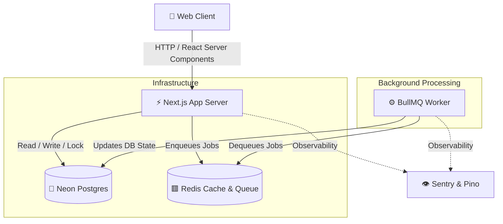

<div align="center">
  <h1>🎟️ BookMySlot</h1>
  <p><strong>A Highly-Concurrent, Production-Grade Slot Booking Platform</strong></p>

  [](https://nextjs.org/)
  [](https://www.typescriptlang.org/)
  [](https://www.prisma.io/)
  [](https://neon.tech/)
  [](https://redis.io/)
  [](https://www.docker.com/)
</div>

<br />

BookMySlot is a robust, distributed slot booking system architected to handle high-throughput concurrent requests reliably. Designed with enterprise-grade patterns like pessimistic locking, idempotent APIs, and asynchronous message processing, it guarantees zero double-bookings under heavy load.

---

## 🏗 System Architecture

BookMySlot separates the web layer from heavy background processing, utilizing Redis as a message broker and Neon (Serverless Postgres) as the source of truth.



---

## ✨ Core Engineering Features

- **Pessimistic Concurrency Control**: Utilizes database-level locking (`SELECT ... FOR UPDATE` via Prisma Interactive Transactions) to completely eliminate race conditions and double-bookings, even with 100+ simultaneous requests to a single slot.
- **Idempotent Payment APIs**: The payment gateway integration is fully idempotent. If a network partition occurs or a client aggressively retries a payment, the system guarantees the charge is processed exactly once using cached idempotency keys.
- **Asynchronous Task Offloading**: Heavy workloads (e.g., email confirmations, ticket PDF generation, analytics) are instantly offloaded to a **BullMQ** queue. A dedicated background Node.js worker processes these tasks, ensuring the main Next.js API remains blazing fast.
- **Admin Dashboard**: Full CRUD management of Venues and Slots, along with real-time ticket oversight.
- **User Profiles & Ticket Management**: Users can manage their upcoming and past bookings and download dynamically generated PDF tickets containing QR codes.
- **Enterprise Observability**: Fully instrumented with **Sentry** for distributed error tracking and **Pino** for structured JSON logging across both the web and worker processes.
- **Containerized Development**: The entire stack is orchestrated via Docker, ensuring identical environments across local development and production.

---

## 🛠 Tech Stack

| Category | Technology |
| :--- | :--- |
| **Frontend & API** | Next.js 16 (App Router), React 19, Tailwind CSS v4 |
| **Database & ORM** | Neon (Serverless PostgreSQL), Prisma 7 |
| **Queue & Cache** | Redis, BullMQ |
| **Authentication** | NextAuth.js (JWT Strategy) |
| **PDF Generation** | PDFKit, QRCode |
| **Testing** | Vitest, Supertest |
| **Containerization** | Docker, Docker Compose |

---

## 🚀 Getting Started

We provide a fully containerized local development environment.

### Prerequisites
- [Docker & Docker Compose](https://www.docker.com/products/docker-desktop/) installed and running.
- Node.js (v20+) and npm (if you want to run tests or scripts locally outside of Docker).

### 1. Environment Setup
Clone the repository and ensure your `.env` file is populated with the Neon DB connection string, NextAuth secrets, Redis URL, and optional SMTP settings (see `.env.example`).

### 2. Start the Stack
Run the following command to build the Next.js web server, the background worker, and the Redis cache all at once:

```bash
docker-compose up --build
```
*Note: We mount your local directory as a volume (`.:/app`), meaning any code changes you make in your IDE will instantly hot-reload inside the Docker container!*

### 3. Database Migrations
If you make changes to `prisma/schema.prisma`, sync them to your Neon database and regenerate the client:
```bash
npx prisma db push
npx prisma generate
```
*(If you do this, you must restart `docker-compose up` to load the new Prisma Client into memory).*

### 4. Database Seeding
To populate your database with initial Venues, Slots, and an Admin account:
```bash
npx prisma db seed
```

---

## 🧪 Testing

The project includes unit test suites focusing on critical system boundaries.

```bash
npm run test
```

- **Concurrency Logic**: Verifies that the booking endpoint correctly utilizes interactive database transactions.
- **Idempotency Logic**: Verifies that re-submitting payments with the same idempotency key returns the cached 200 response rather than re-processing the charge.

---

## 🔐 Security & Best Practices

- **Zero-Trust Input**: Every API route and Server Action validates incoming payloads against strict Zod schemas before processing.
- **Global Error Handling**: All unhandled exceptions in React Server Components and API routes are caught by a global middleware, sanitizing the response to prevent leaking stack traces to the client while logging the full context to Sentry.
- **Role-Based Access Control (RBAC)**: Distinct permissions for `USER` and `ADMIN` entities, securely verified at the session level.
